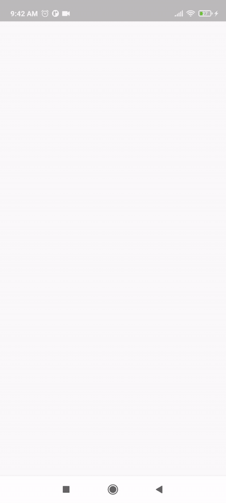

# progress_button

Creates a progress button with smooth animation with the supplied value in percentage.

<hr/>

### Basic Example:
```dart
ProgressButton(
  value: 100.0,
  height: 65.0,
  onPressed: (progress) {},
  margin: const EdgeInsets.all(10.0),
  animationDuration: Duration(milliseconds: 8000),
  child: Text(
    "Uploading...",
    style: TextStyle(
      fontWeight: FontWeight.bold,
      color: Colors.white,
      fontSize: 18.0,
    ),
  ),
)
```



<hr/>

### Parameters
| parameter | description | default |
| :--- | :--- | :--- |
| value | The percentage value of the progress indicator. | required |
| width | The width of the progress button. | screen width |
| height | The height of the progress button. | 50.0 |
| child | The widget that is displayed in the center of the progress button. It is usually a text widget. | null |
| borderRadius | The border radius of the button. | 4.0 |
| margin | The margin around the progress button. | EdgeInsets.all(0.0) |
| backgroundColor | The background color of the progress button. | Color(0xffd6d6d6) |
| progressColor | The color of the progress indicator. | Colors.green |
| onPressed | The function that will be called when user taps on the button. | required |
| onValueChange | The function that will be called everytime the progress of the button changes. | null |
| active | The active state of the button. | true |
| animationDuration | The animation duration of the progress animation. | Duration(milliseconds: 2000) |
| animationCurve | The animation curve of the progress animation | Curves.easeOutSine |


